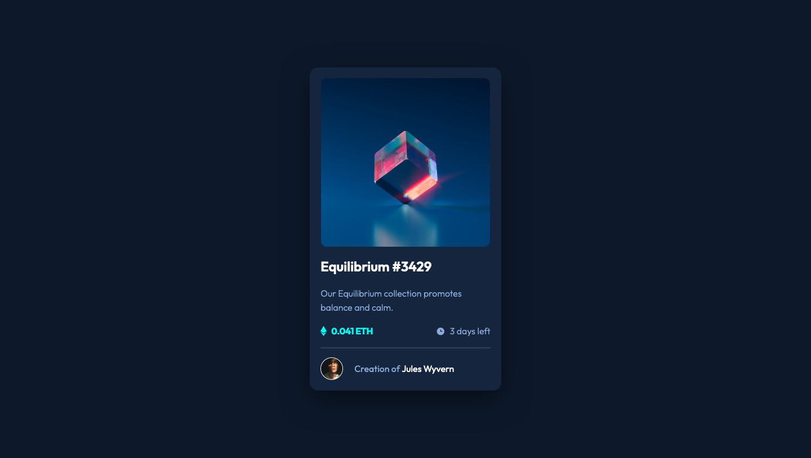

# Tecnologia_para_Front
# Frontend Mentor - NFT preview card component solution

This is a solution to the [NFT preview card component challenge on Frontend Mentor](https://www.frontendmentor.io/challenges/nft-preview-card-component-SbdUL_w0U). Frontend Mentor challenges help you improve your coding skills by building realistic projects.

### Screenshot

### Links

- Solution URL: [https://www.frontendmentor.io/solutions/nft-preview-card-using-html-css-and-flexbox-GeBShcdRZ](https://www.frontendmentor.io/solutions/nft-preview-card-using-html-css-and-flexbox-GeBShcdRZ)
- Live Site URL: [https://nakoyawilson.github.io/nft-preview-card-component/](https://nakoyawilson.github.io/nft-preview-card-component/)

## Authors

- Felipe Pereira 
- Kennedy Ferreira
- Arthur Filipe
